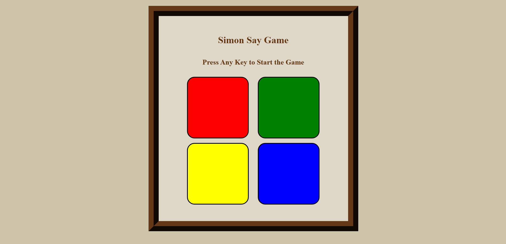

# 🎮 Simon Says Game

A fun and interactive memory-based game built using **HTML**, **CSS**, and **JavaScript**.

In this game, the computer generates a random sequence of button flashes, and you must repeat the pattern in the correct order. The sequence gets longer with each level, testing your memory and attention!

---

## How to Play

1. Press any key to start the game.
2. Watch the sequence of colors shown by the game.
3. Click the buttons in the exact same order.
4. If you get it right, you move to the next level.
5. If you make a mistake, the game ends and you can start again.

---

## 🌟 Features

- ✅ Randomly generated color sequences
- ✅ Visual feedback on button presses
- ✅ Game level progression
- ✅ "Game Over" alert and reset option
- ✅ Clean and responsive UI

---

## 🧰 Tech Stack

- **HTML** – For page structure
- **CSS** – For styling and animations
- **JavaScript** – For game logic and interactivity

---

## 📸 Preview

---

## Check it Out

You can view the full project and source code here:  
👉 [GitHub Repo - memory-master-simon-game](https://github.com/VanshChoudhary7/memory-master-simon-game)
